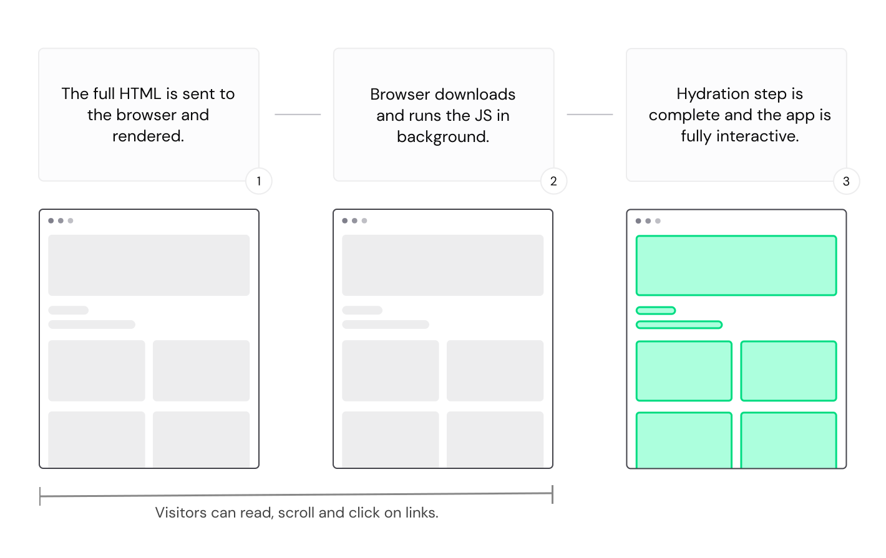

# Documentation

## Typescript

### Basic Types - [Ref](https://www.typescriptlang.org/docs/handbook/basic-types.html)
```js
# Boolean 
let isDone: boolean = false;

# Number
let decimal: number = 6;
let hex: number = 0xf00d;
let binary: number = 0b1010;
let octal: number = 0o744;
let big: bigint = 100n;

# String 
let color: string = "blue";

# Array
let list: number[] = [1, 2, 3];
let list: Array<number> = [1, 2, 3];

# Tuple 
let x: [string, number];

# Enum 
enum Color {
  Red,
  Green,
  Blue,
}

```

## The Main Styles: Interface vs Type - [Ref](https://stackoverflow.com/questions/37233735/interfaces-vs-types-in-typescript)
### Interface Style
```js
interface {
    x: number
    y: number
}

interface SetPoint {
  (x: number, y: number): void;
}

```

### Type Alias Style

```js
type Point = {
  x: number;
  y: number;
};

type SetPoint = (x: number, y: number) => void;

```

### Type Alias Style Extras
```js
// primitive
type Name = string;

// object
type PartialPointX = { x: number; };
type PartialPointY = { y: number; };

// union
type PartialPoint = PartialPointX | PartialPointY;

// tuple
type Data = [number, string];

```


## Tailwind 
### Installation Guide [Official](https://tailwindcss.com/docs/installation) / [Nuxt Module](https://tailwindcss.nuxtjs.org/)

### Editor Setup - [Ref](https://tailwindcss.com/docs/editor-setup)

### Core Concepts - [Ref](https://tailwindcss.com/docs/utility-first)

#### Utility First 
"Normal"
```svelte
<div class="chat-notification">
  <div class="chat-notification-logo-wrapper">
    
  </div>
  <div class="chat-notification-content">
    <h4 class="chat-notification-title">ChitChat</h4>
    <p class="chat-notification-message">You have a new message!</p>
  </div>
</div>

<style>
  .chat-notification {
    display: flex;
    max-width: 24rem;
    margin: 0 auto;
    padding: 1.5rem;
    border-radius: 0.5rem;
    background-color: #fff;
    box-shadow: 0 20px 25px -5px rgba(0, 0, 0, 0.1), 0 10px 10px -5px rgba(0, 0, 0, 0.04);
  }
  .chat-notification-logo-wrapper {
    flex-shrink: 0;
  }
  .chat-notification-logo {
    height: 3rem;
    width: 3rem;
  }
  .chat-notification-content {
    margin-left: 1.5rem;
    padding-top: 0.25rem;
  }
  .chat-notification-title {
    color: #1a202c;
    font-size: 1.25rem;
    line-height: 1.25;
  }
  .chat-notification-message {
    color: #718096;
    font-size: 1rem;
    line-height: 1.5;
  }
</style>
```

Tailwind Style 
```svelte
<div class="p-6 max-w-sm mx-auto bg-white rounded-xl shadow-lg flex items-center space-x-4">
  <div class="shrink-0">
    
  </div>
  <div>
    <div class="text-xl font-medium text-black">ChitChat</div>
    <p class="text-slate-500">You have a new message!</p>
  </div>
</div>
```


In essence, Tailwind provides utility classes like: 

- flexbox
- padding
- margin 
- max-width
- background color
- border radius 
- box-shadow
- width
- height 
- space-between 
- font size, text color and font weights 
- and many many more


##### Why Bother?

- no need to think of class names 
- css keeps growing. With the utilities approach, you just reuse utilities 
- no fear when making changes to your css. Tailwind classes are local, whereas css is global 

##### Inline Styles are the same...no?
- Tailwind gives design constrants and a design system. Example p-1 doesnt mean padding with 1 px, it means 0.25rem (4px)
- Responsive design. Tailwind has responsive utilities so no need for media queries 
- Hover, focus and other states. Inline styles can’t target states like hover or focus,

#### Hover, Focus and Other States - [Ref](https://tailwindcss.com/docs/hover-focus-and-other-states)

Refer to docs :-)

#### Responsive Design 

| Breakpoint prefix | Minimum width | CSS                                |
|-------------------|---------------|------------------------------------|
| sm                | 640px         | @media (min-width: 640px) { ... }  |
| md                | 768px         | @media (min-width: 768px) { ... }  |
| lg                | 1024px        | @media (min-width: 1024px) { ... } |
| xl                | 1280px        | @media (min-width: 1280px) { ... } |
| 2xl               | 1536px        | @media (min-width: 1536px) { ... } |
|                   |               |                                    |

```vue
<!-- Width of 16 by default, 32 on medium screens, and 48 on large screens -->

```

#####  Mobile First 
'Where this approach surprises people most often is that to style something for mobile, you need to use the unprefixed version of a utility, not the sm: prefixed version. Don’t think of sm: as meaning “on small screens”, think of it as “at the small breakpoint“.'

```vue
<!-- This will center text on mobile, and left align it on screens 640px and wider -->
<div class="text-center sm:text-left"></div>
```

#### Reusing Styles 

- Multi Cursor Editing: [Nice Article](https://davidamos.dev/vs-code-multi-cursors/)
- Loops: v-for, .map(...), etc 
- Defining Components :-)


### It's just CSS! - Check out the [docs](https://tailwindcss.com/docs) 

And just do Ctrl + K and whatever CSS property you are interested in :-)

## Nuxt - [Ref](https://nuxt.com/)

[Nuxtr](https://marketplace.visualstudio.com/items?itemName=Nuxtr.nuxtr-vscode) - Quality of life plugin for Nuxt
[Volar](https://marketplace.visualstudio.com/items?itemName=Vue.volar) and [Volar Takeover Mode](https://vuejs.org/guide/typescript/overview.html#volar-takeover-mode) - Language support for Vue 3 with Typescript

### What is it? - [Ref](https://nuxt.com/docs/getting-started/introduction)

### SSR Simplified - [Ref](https://nuxt.com/docs/guide/concepts/rendering)

#### Universal Rendering
In essence, you get a full HTML page on page load because Nuxt ran the JS (Vue.js) code in a server environment. Then...the client (browser) downloads the JS and the client (browser) interprets it again and Vue.js takes control of the document and enables interactivity 

Making the static HTML page interactive is called "Hydration"

 

#### Client Side Rendering 
 

### Writing SSR Friendly Code - [Ref](https://vuejs.org/guide/scaling-up/ssr.html#writing-ssr-friendly-code)

#### Component Lifecycle
- Since there are no dynamic updates, lifecycle hooks such as onMounted or onUpdated will NOT be called during SSR and will only be executed on the client.
- You should avoid code that produces side effects that need cleanup in setup() or the root scope of <script setup>. An example of such side effects is setting up timers with setInterval
- In client-side only code we may setup a timer and then tear it down in onBeforeUnmount or onUnmounted

#### How to run on only the server 

```vue
if(process.server) {...}
```

#### How to Run only on the client 
```vue
if(process.client) {...}
# onMounted has the added benefit that it guarentees  that the DOM is available
onMounted(()=> {....})
```

#### Access to Platform-Specific API

- Universal code cannot assume access to platform-specific APIs, so if your code directly uses browser-only globals like **window** or **document**, they will throw errors when executed in Node.js, and vice-versa.
- I recommend using **[template refs](https://vuejs.org/guide/essentials/template-refs.html)** if you need direct access to the DOM. **onMounted** is required in this case


### Components - [Ref](https://nuxt.com/docs/guide/directory-structure/components)

The components/ directory is where you put all your Vue components. All components are auto-imported!

### Composables - [Ref](https://nuxt.com/docs/guide/directory-structure/composables) and [Composables in Depth](https://vuejs.org/guide/reusability/composables.html) and [VueUse](https://vueuse.org/) / [VueUse Install](https://vueuse.org/guide/#nuxt)

Nuxt 3 uses the composables/ directory to automatically import your Vue composables into your application using auto-imports!

Warning: You have to run nuxi prepare, nuxi dev or nuxi build in order to let Nuxt generate the types. If you create a composable without having the dev server running, TypeScript will throw an error, such as Cannot find name 'useBar'.

Warning 2: It must start with use{theNameOfYourComposableGoesHere}

A "composable" is a function that leverages Vue's Composition API to encapsulate and reuse **stateful logic**. It is the equivalent to [React's Hooks](https://vuejs.org/guide/extras/composition-api-faq.html#comparison-with-react-hooks)

Example of Vue's Composition API (the most important ones):
- ref
- onMounted
- onUnMounted
- watchEffect
- watch
- computed 
- etc....
- 
#### All Composition API - [Ref](https://vuejs.org/api/)

!(Vue Composition Api)[./images/comp-api.png]

### Layouts - [Ref](https://nuxt.com/docs/guide/directory-structure/layouts) and [Slots](https://vuejs.org/guide/components/slots.html)

Layouts are used for extracting common UI or code patterns into reusable layout component by using Slots

### Pages - [Ref](https://nuxt.com/docs/guide/directory-structure/pages)

File based routing via pages 

### Utils - [Ref](https://nuxt.com/docs/guide/directory-structure/utils)

Nuxt 3 uses the utils/ directory to automatically import helper functions and other utilities throughout your application using auto-imports!

Warning: It must start with use{theNameOfYourUtilGoesHere}

### Stores - [Setup Stores](https://pinia.vuejs.org/core-concepts/#Setup-Stores) and [Pinia Install](https://pinia.vuejs.org/ssr/nuxt.html)

Stores are your application state. 

Pinia itself has many advantages such as - [ref](https://pinia.vuejs.org/introduction.html):
- Dev tools support   
  - A timeline to track actions, mutations  
  - Stores appear in components where they are used  
  - Time travel and easier debugging  
- Hot module replacement  
  - Modify your stores without reloading your page  
  - Keep any existing state while developing  
- Plugins: extend Pinia features with plugins  
- Proper TypeScript support or autocompletion for JS users  
- Server Side Rendering Support  

### Nuxt Core Concepts 

#### Data Fetching - [Ref](https://nuxt.com/docs/getting-started/data-fetching)

Since Nuxt renders pages on both the server and the client environments, some challenges need to be addressed. Therefore, you can use composables to perform data fetching: 
- useFetch
- useAsyncState

You can also use $fetch

The ofetch library is built on top of the fetch API and adds handy features to it:
- Works the same way in browser, Node or worker environments
- Automatic response parsing
- Error handling
- Auto-retry
- Interceptors

##### Effective Caching 
useFetch and useAsyncData both use a key to cache API responses and further reduce API calls. Choosing a good value here will improve the performance of your app

Tip: pagination (current page), queries can be included here to increase performance

##### Minimize the Payload
The **pick** option helps you to minimize the payload size stored in your HTML document by only selecting the fields that you want returned from the composables.
```vue
const { data, error, refresh } = await useFetch('api/somePath', {
  /* only get the id from the api */
  pick: [id]
})
```

#### Watch and Re-Run
To re-run your fetching function each time other reactive values in your application change, use the **watch** option.
```vue
const { data, error, refresh } = await useFetch(`yourApi/somePath?id=${id.value}`, {
  /* Changing the id will trigger a refetch */
  watch: [id]
})
```

#### SEO - [Ref](https://nuxt.com/docs/getting-started/seo-meta)

##### useHead
```vue

useHead({
  title: "Your title",
  meta: [
    {
      name: "Your fancy description",
    },
    {
      property: "og:image",
      content:
        "url-to-your-og-image",
    },
  ],
});
```

##### useServerSeoMeta
```vue
<script setup lang="ts">
useSeoMeta({
  title: 'My Amazing Site',
  ogTitle: 'My Amazing Site',
  description: 'This is my amazing site, let me tell you all about it.',
  ogDescription: 'This is my amazing site, let me tell you all about it.',
  ogImage: 'https://example.com/image.png',
  twitterCard: 'summary_large_image',
})
</script>
```

#### Deployments - [Ref](https://nuxt.com/docs/getting-started/deployment)

With [Vercel](https://nitro.unjs.io/deploy/providers/vercel), you only need to connect your Github repo and everything else is handled :-)

### Cool Packages and Modules - [Ref](https://nuxt.com/modules)

#### Image Optimization - [Ref](https://image.nuxtjs.org/)
Resize and transform your images using built-in optimizer or your favorite images CDN.

#### Icon - [Ref](https://nuxt.com/modules/icon)
Add 100,000+ ready to use icons to your Nuxt application, based on Iconify.

#### DaisyUI - [Ref](https://daisyui.com/)
daisyUI is a plugin for Tailwind CSS. It works on all JS frameworks and doesn't need a JS bundle file.

#### Tailwind Typography - [Ref](https://tailwindcss.com/docs/typography-plugin)
The official Tailwind CSS Typography plugin provides a set of **prose** classes you can use to add beautiful typographic defaults to any vanilla HTML you don’t control, like HTML rendered from Markdown, or pulled from a CMS.